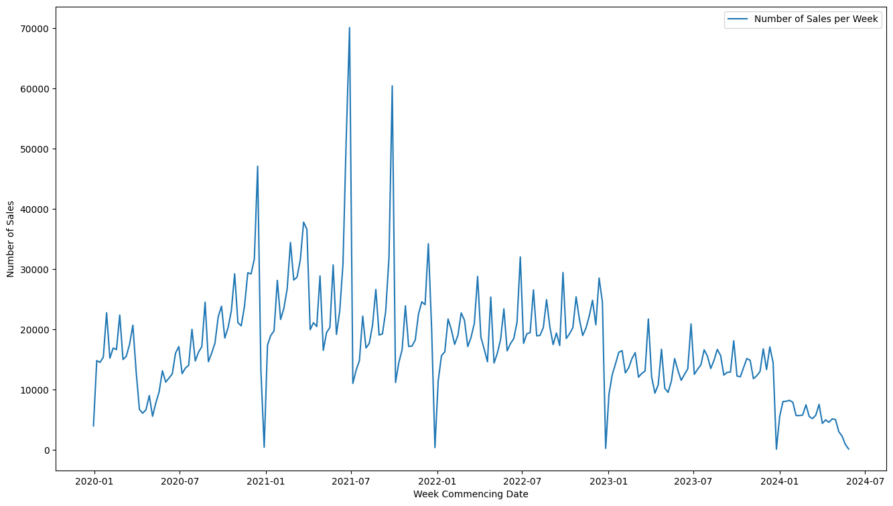
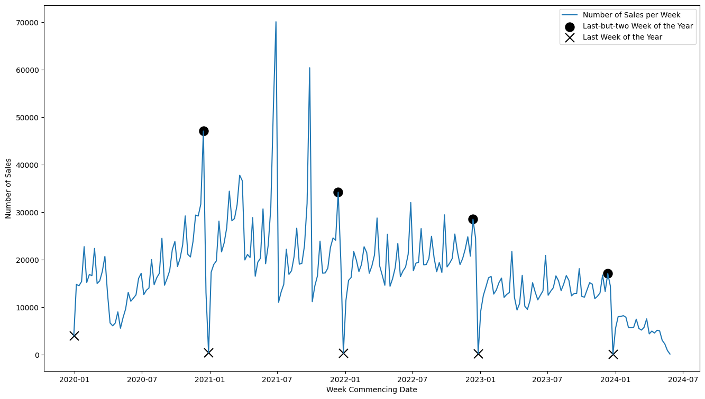
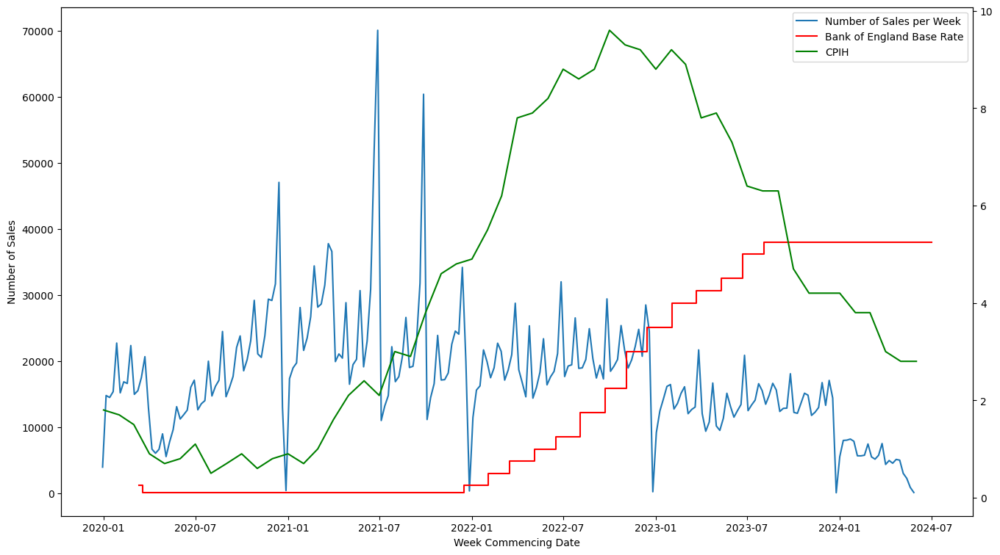
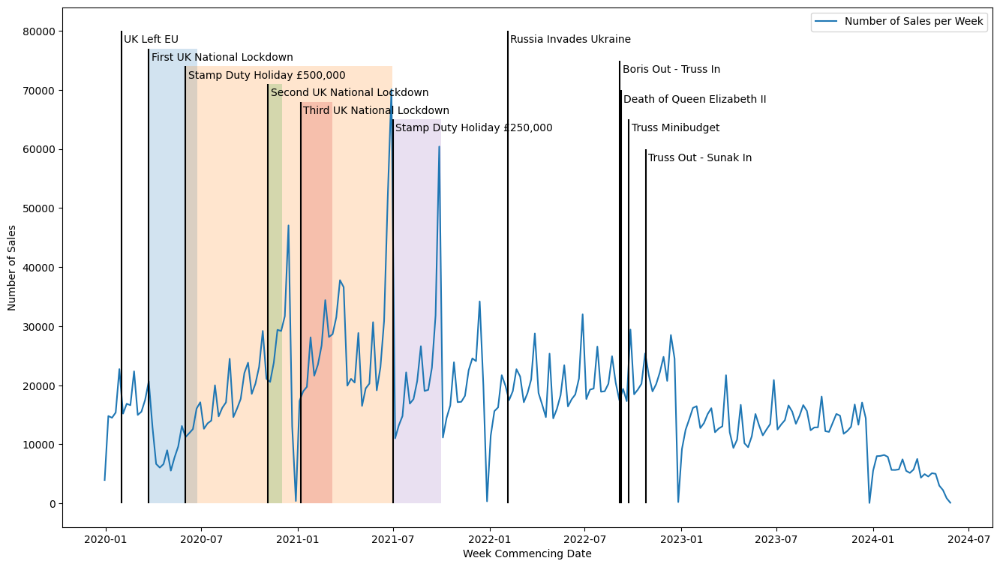
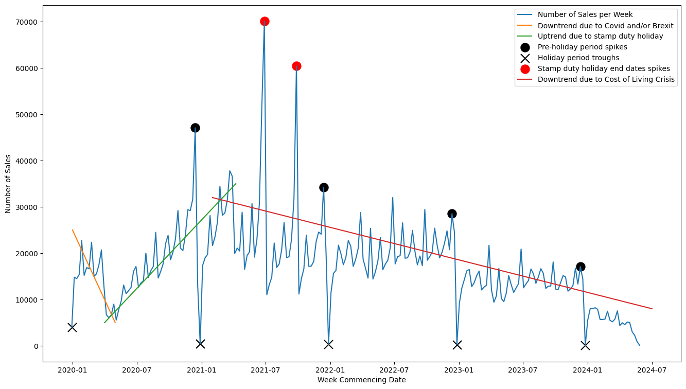
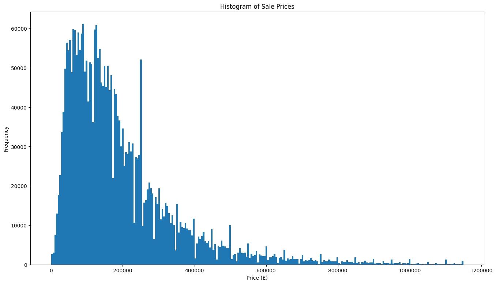
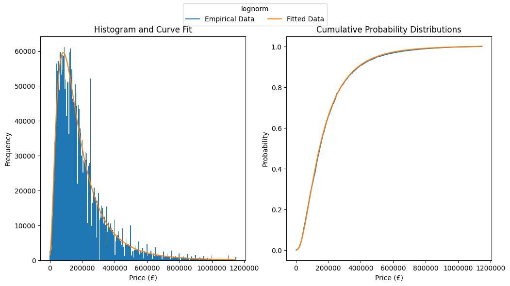
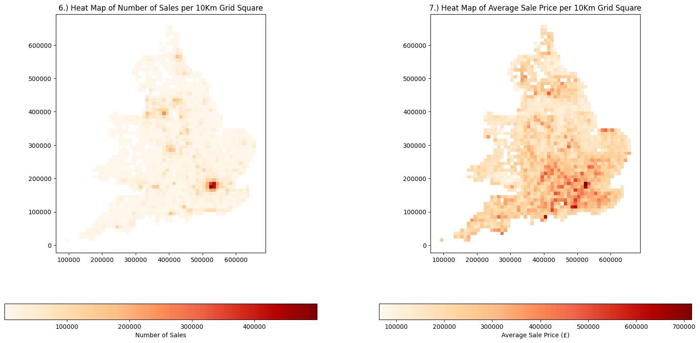

# James Buntwal
## Assessment for Senior Data Scientist
---

#### Imports


```python
# Interal
import ManageData as md
import ManagePlots as mp

# Standard Library
import logging
import functools

# External
import pyspark as ps
from pyspark.sql import functions as psf
import pandas as pd
import geopandas as gpd
import numpy as np
import scipy
```

#### Formatting and Configuration


```python
# Pandas decimal formatting - stops scientific notation
pd.set_option('display.float_format', lambda x: '%.2f' % x)
# Suppress pyspark warnings
logging.getLogger("py4j").setLevel(logging.ERROR)
```

#### Create Spark Session

I decided to use pyspark for this assessment as the data is large. I adjusted the RAM values below to accomodate the large datasets.


```python
spark = (
    ps.sql
    .SparkSession
    .builder
    .appName("Local")
    .master(f"local[*]")
    .config("spark.executor.memory", "8g")
    .config("spark.driver.memory", "8g")
    .config("spark.sql.execution.arrow.pyspark.enabled", "true")
    .config("spark.sql.execution.arrow.pyspark.fallback.enabled", "true")
    .config("spark.driver.maxResultSize", "16g")
    .config('spark.ui.showConsoleProgress', False)
    .getOrCreate()
)
sc = spark.sparkContext
sc.setLogLevel("ERROR")
```

#### Load Paid for Price data into a PySpark Dataframe
In ManageData.py I create functions to read in the paid for price data from the CSV file into a pyspark dataframe.


```python
PPD = md.get_PPD(spark)
```

### 1.) Find two land registry records that are likely to be errors
- In each case, provide a potential explanation

<b>Potential Error #1</b>

transaction ID = {1A0C5C63-E47F-7CBE-E063-4804A8C06C96}

<b>Explanation</b> 

The postcode is missing. This may be caused by a simple data input error at source. A quick google search of the address shows a valid postcode exists, therefore confirming the error.
Interestingly there were 47,285 rows where the postcode is missing. I simply chose the most recent. 

<b>Method</b>

1. Filter the price paid dataset where the postcode is null.
1. Order by date of transfer.
1. Limit by top 5 as printing all observations is unecessary.
1. Convert to pandas for easy handling.
1. View data set.


<b>Notes</b>

Before finding out there were a large number of missing postcodes I had the idea to use regular expressions to validate whether postcodes were correct or not. If there were more time this could be a 'next steps' or 'nice to have'. Also, in question 2 I discovered more errors that could be valid answers for this question.


```python
five_most_recent_missing_postcode = (
    PPD
    .filter(    psf.col('postcode').isNull()
                )
    .orderBy(   psf.desc('date_of_transfer')
                )
    .limit(5)
)
# View data
print(five_most_recent_missing_postcode.toPandas())

# NB: 47,285 total rows with missing postcodes
count_of_null_postcodes = PPD.filter(psf.col('postcode').isNull()).count()
print(f"\nTotal number with missing postcodes: {count_of_null_postcodes}\n")

```

                               transaction_id     price date_of_transfer postcode  \
    0  {1A0C5C63-E47F-7CBE-E063-4804A8C06C96}    560000       2024-05-30     None   
    1  {1A0C5C63-E897-7CBE-E063-4804A8C06C96}  11423940       2024-05-15     None   
    2  {1A0C5C63-F9ED-7CBE-E063-4804A8C06C96}  10043024       2024-05-15     None   
    3  {1A0C5C63-C868-7CBE-E063-4804A8C06C96}    225000       2024-05-08     None   
    4  {1A0C5C63-E523-7CBE-E063-4804A8C06C96}      9950       2024-04-30     None   
    
      property_type old_new duration         PAON    SAON              street  \
    0             T       N        F           52    None  DRAYTON GREEN ROAD   
    1             O       N        F      LAND AT    None   HARTLEPOOL MARINA   
    2             O       N        F          194    None         DOCK STREET   
    3             F       N        L          19A  FLAT 2       ST MARYS ROAD   
    4             O       N        F  PLOT TDA 62    None      DUNSTABLE ROAD   
    
         locality       town_city              district                county  \
    0        None          LONDON                EALING        GREATER LONDON   
    1        None      HARTLEPOOL            HARTLEPOOL            HARTLEPOOL   
    2        None       FLEETWOOD                  WYRE            LANCASHIRE   
    3        None  LEAMINGTON SPA               WARWICK          WARWICKSHIRE   
    4  TODDINGTON       DUNSTABLE  CENTRAL BEDFORDSHIRE  CENTRAL BEDFORDSHIRE   
    
      PPD_category_type record_status_monthly_file_only  
    0                 B                               A  
    1                 B                               A  
    2                 B                               A  
    3                 A                               A  
    4                 B                               A  
    
    Total number with missing postcodes: 47285
    


<b>Potential Error #2</b>

transaction ID = {1A0C5C64-0E03-7CBE-E063-4804A8C06C96}

<b>Explanation</b> 

This transaction was of an incredibly large amount (£900 million) and feels unrealistically large. I looked at the transactions for properties at the same postcode and they were no where near (£50k - £265k). I believe this transaction to be an anomaly/erroneous and if I were investigating the data before modelling I would strongly consider removing this row.

<b>Method</b>

1. Find min and max price paid values. Initially I thought there may be some incorrect negative values but the lower cap was £1 which is plausable. 
1. Save the max price into a variable.
1. find the transaction id and postcode associated with this max price.
1. view prices for other transactions at that postcode for reference.


```python
# find min and max values
minmax = (
    PPD
    .select(    psf.min("price").alias("min_value"),
                psf.max("price").alias("max_value")
                )
)
print(f"Min and max paid for prices")
print(minmax.toPandas())

# put max price into a variable
max_price = minmax.collect()[0][1]

# find associated transaction
max_price_transaction_id = (
    PPD
    .filter(    psf.col('price') == max_price
                )
    .select(    "transaction_id"
                )
    .collect()
    [0][0]
)

# view data for max price transaction
max_price_transaction_row = PPD.filter(psf.col('transaction_id') == max_price_transaction_id)
print("\nMax price transaction row")
print(
    max_price_transaction_row
    .select('transaction_id', 'price', 'date_of_transfer', 'postcode')
    .toPandas()
    .T
    )

# find postcode of max price transaction
mp_postcode = max_price_transaction_row.select('postcode').collect()[0][0]

# find other transactions for that postcode
print(f"\nTransactions for postcode: {mp_postcode}")
print(
    PPD
    .filter(psf.col('postcode') == mp_postcode)
    .select('transaction_id', 'price', 'date_of_transfer', 'property_type', 'street', 'postcode')
    .toPandas()
    )
```

    Min and max paid for prices
       min_value  max_value
    0          1  900000000
    
    Max price transaction row
                                                           0
    transaction_id    {1A0C5C64-0E03-7CBE-E063-4804A8C06C96}
    price                                          900000000
    date_of_transfer                     2021-03-29 00:00:00
    postcode                                        TN23 7HE
    
    Transactions for postcode: TN23 7HE
                               transaction_id      price date_of_transfer  \
    0  {CFC2F06E-19F7-4E73-8DA2-F19AF8CCFF45}      50000       1998-01-09   
    1  {1FADD523-1080-4672-B745-9B88304B8193}      50000       1998-01-09   
    2  {6E0F5332-7849-4209-B14E-05C74BA7E22E}      60000       1998-08-14   
    3  {DB6351D3-5E21-4E56-8A43-399AA64F2E77}     150000       2004-08-24   
    4  {81C4A1C0-644B-4336-AA28-6DA3283551D7}     153000       2005-02-25   
    5  {0F863C6F-04EB-4E91-899B-C378E1A5CD2F}     153000       2005-02-25   
    6  {B0A9D11B-843F-4C1F-E053-6C04A8C0D716}     265000       2020-08-18   
    7  {1A0C5C64-0E03-7CBE-E063-4804A8C06C96}  900000000       2021-03-29   
    8  {CFC9085D-5EAC-9A70-E053-6B04A8C09D6A}     155000       2021-09-22   
    
      property_type         street  postcode  
    0             S  VICTORIA ROAD  TN23 7HE  
    1             S  VICTORIA ROAD  TN23 7HE  
    2             S  VICTORIA ROAD  TN23 7HE  
    3             S  VICTORIA ROAD  TN23 7HE  
    4             S  VICTORIA ROAD  TN23 7HE  
    5             S  VICTORIA ROAD  TN23 7HE  
    6             S  VICTORIA ROAD  TN23 7HE  
    7             O  VICTORIA ROAD  TN23 7HE  
    8             S  VICTORIA ROAD  TN23 7HE  


---

### 2.) Complete the following table by calculating the number of sales and average sale price for all London Boroughs in 2023

<b>Explanation</b>

I took London boroughs to be `districts` where `town_city == "LONDON"`. When investigating the data I noticed there were some errors and districts that weren't London Boroughs were present. I used wikipedia (https://en.wikipedia.org/wiki/List_of_London_boroughs) to cross reference and put the errors in a list of exclusions. These errors could also have been valid answers for question 1. There is also a grey area with Epping Forest as apparently it has some overlap with Waltham Forest. Further investigation could lead to mapping certain Epping Forest postcodes to be included below however I felt this was an unecessary level of detail to go into.

<b>Method</b>

1. Filter for town_city == LONDON.
1. Filter for district not in exclusion list. This step was added afterwards when I found the errors.
1. Filter for date of transfer to be 2023 dates. I could have also used where 01/01/2023 <= date <= 31/12/2023.
1. Group by the district.
1. Aggregate for count of price and average of price.
1. Renaming/aliasing as necessary.
1. Convert to Pandas and sort before printing.


```python
# exclusion list
not_london_boroughs = [
    'CITY OF BRISTOL',
    'EPPING FOREST',
    'MALVERN HILLS',
    'RHONDDA CYNON TAFF',
    'THURROCK'
]

# pyspark df of aggregated sales
london_sales = (
    PPD
    .filter(                psf.col('town_city') == 'LONDON'
                            )
    .filter(                ~psf.col('district').isin(not_london_boroughs)
                            )
    .filter(                psf.year(psf.col('date_of_transfer')) == 2023
                            )
    .groupBy(               'district'
                            )
    .agg(                   psf.count('price').alias("Count of Sales in 2023"),
                            psf.avg('price').alias('Average Sale Price in 2023')
                            )
    .withColumnRenamed(     'district',
                            'London Borough'
                            )
    .toPandas(              )
    .sort_values(           'London Borough'
                            )
    .reset_index(           drop = True
                            )
)

# Show results
print(london_sales)
```

                London Borough  Count of Sales in 2023  Average Sale Price in 2023
    0     BARKING AND DAGENHAM                       1                   560000.00
    1                   BARNET                    2396                   886932.60
    2                   BEXLEY                     139                   399589.64
    3                    BRENT                    1141                   718214.44
    4                  BROMLEY                     493                   454393.00
    5                   CAMDEN                    1926                  1498985.59
    6           CITY OF LONDON                     202                  4399887.20
    7      CITY OF WESTMINSTER                    2648                  2360142.44
    8                  CROYDON                     768                   437109.28
    9                   EALING                    1942                   819727.94
    10                 ENFIELD                    1213                   572089.16
    11               GREENWICH                    2376                   546050.33
    12                 HACKNEY                    2017                   735308.05
    13  HAMMERSMITH AND FULHAM                    2081                   995953.94
    14                HARINGEY                    2128                   817636.64
    15                HOUNSLOW                     416                  1197561.78
    16               ISLINGTON                    1901                  1047219.56
    17  KENSINGTON AND CHELSEA                    1886                  2551103.91
    18    KINGSTON UPON THAMES                      30                   935346.27
    19                 LAMBETH                    3218                   679726.87
    20                LEWISHAM                    2568                   537376.59
    21                  MERTON                    1359                   846288.47
    22                  NEWHAM                    1709                   507334.27
    23               REDBRIDGE                     481                   654119.26
    24    RICHMOND UPON THAMES                     419                  1234323.94
    25               SOUTHWARK                    2564                   744740.74
    26           TOWER HAMLETS                    2397                   843265.08
    27          WALTHAM FOREST                    2476                   585955.46
    28              WANDSWORTH                    4368                   840767.62


---

### 3.) Count the number of new build Flats sold in each UK region since the start of 2020

<b>Explanation</b>

I used the NSPL data and the corresponding names and codes data to create a lookup table to assign regions to postcodes. This was done in the ManageData.py script and loaded here as a function to keep things tidy and readable.
Once this had been done it was simply just a task of filtering, grouping, and taking counts.

<b>Method</b>

1. Load the postcode lookup from ManageData.
1. Filter the Paid for Price data for new builds.
1. Filter for Flats.
1. Filter for transfer dates greater than or equal to 01-01-2020.
1. Join the region names from the lookup table.
1. Group by the regions and take counts.


```python
# Get postcode-region lookup
postcode_region_lookup = md.get_postcode_region_lookup(spark)

# new build flats since 2020
new_builds_since_2020 = (
    PPD
    .filter(    psf.col('old_new') == "Y"
                )
    .filter(    psf.col('property_type') == 'F'
                )
    .filter(    psf.to_date(psf.col('date_of_transfer')) >= psf.to_date(psf.lit('2020-01-01'))
                )
    .join(      postcode_region_lookup,
                'postcode',
                'left'
                )
    .groupBy(   'region'
                )
    .count(     )
)

# Show results
print(new_builds_since_2020.toPandas())
```

                          region  count
    0                 North West  12863
    1                 South East  16614
    2                     London  41864
    3            East of England   9929
    4                 South West   6866
    5   Yorkshire and The Humber   4527
    6              East Midlands   2343
    7              West Midlands   6971
    8                 North East    976
    9             (pseudo) Wales   1249
    10                      None    217


---

### 4.) Plot the number of sales per week since the start of 2020 as a line chart
- Discuss the chart, and provide potential explanations for any patterns or anomalies

<b>Explanation</b>

I used PySpark's `date_trunc` function to snap the transfer dates to their closest previous Monday. Grouping by this week commencing date gave me weekly values for the count of sales. I also gathered third party data for the analysis: Historic Bank of Englands base rates and historic Consumer Pridce Index rates, and I used google to find dates for significant political events.

<b>Method</b>

1. Filter PPD for dates greater than or equal to `01-01-2020`.
1. Create a new column for the corresponding week commencing date.
1. Group by this new week starting date column.
1. Specify summary functions for aggregation.
1. Order by the date groups.
1. Extract year, month, and day temporal features.
1. Isolate the final, the last but 1, and the last but 2 weeks of each year.
1. Read in the BoE base rates data and the CPIH data.

<b>Notes</b>
- When snapping transfer dates to their closest previous monday, some dates within the first week of the year may be snapped to a week commencing date of the last monday of the previous year. This only really matters for the first week of 2020 as we filtered out all 2019 points, meaning the final week of 2019 may be present but it will be incomplete.


```python
# Main sales per week table
sales_per_week = (
    PPD
    .filter(        psf.to_date(psf.col('date_of_transfer')) >= psf.to_date(psf.lit('2020-01-01'))
                    )
    .withColumn(    'week_start',
                    psf.date_trunc( 'week',
                                    psf.col('date_of_transfer')
                                    )
                    )
    .groupBy(       'week_start'
                    )
    .agg(           psf.count(psf.col('price')).alias('count'),
                    psf.avg(psf.col('price')).alias('AvgPrice'),
                    psf.expr('percentile_approx(price, 0.75)').alias('upperquartPrice'),
                    psf.expr('percentile_approx(price, 0.5)').alias('MedianPrice'),
                    psf.expr('percentile_approx(price, 0.25)').alias('lowerquartPrice')
                    )
    .orderBy('week_start')
    .toPandas()
)

# Add temporal features
week_start_dt = sales_per_week.week_start.dt
sales_per_week['year'] = week_start_dt.year
sales_per_week['month'] = week_start_dt.month
sales_per_week['day'] = week_start_dt.day

# Get list of dates corresponding to the last weeks of each year
last_weeks = md.last_but_n_weeks(sales_per_week, 0)

# Get list of dates corresponding to last-but-one weeks of the year
last_b1_weeks = md.last_but_n_weeks(sales_per_week, 1)

# Get list of dates corresponding to last-but-two weeks of the year
last_b2_weeks = md.last_but_n_weeks(sales_per_week, 2)

# Bank of England Base Rate Data
BoE = md.get_bank_of_england()

# Consumer Price Index Data (CPIH)
CPIH = md.get_consumer_price_indices()

# Show head of data
print(sales_per_week.head(10))
```

      week_start  count  AvgPrice  upperquartPrice  MedianPrice  lowerquartPrice  \
    0 2019-12-30   3958 355758.31           358500       235000           150000   
    1 2020-01-06  14798 355388.01           382000       242000           149000   
    2 2020-01-13  14504 364229.60           355000       225000           140000   
    3 2020-01-20  15387 324786.74           355000       225000           140750   
    4 2020-01-27  22741 350409.19           364995       235000           150000   
    5 2020-02-03  15202 350933.24           358000       227500           143750   
    6 2020-02-10  16877 330529.96           358000       230000           145000   
    7 2020-02-17  16627 339537.11           356000       231500           149500   
    8 2020-02-24  22365 372381.19           365000       237500           150000   
    9 2020-03-02  14981 343822.83           360000       230500           145000   
    
       year  month  day  
    0  2019     12   30  
    1  2020      1    6  
    2  2020      1   13  
    3  2020      1   20  
    4  2020      1   27  
    5  2020      2    3  
    6  2020      2   10  
    7  2020      2   17  
    8  2020      2   24  
    9  2020      3    2  


<b>Discussion</b>

The graph below is the number of sales per week since the start of 2020 as a line graph. Clearly the trend is that from 2020 to 2021 it starts at a relative high and has a very quick drop off around spring 2020. There is a general increase (with volatility) until the beginning of 2021. From there, there is a general downtrend until the beginning of 2022, with volatility and two seemingly anomalous spikes.


```python
mp.plot_sales_per_week(sales_per_week)
```


    

    


The graph below shows the regular troughs seen towards the ends of each year is consistently the last week in the year. Logically, this makes a lot of sense as due to the christmas and new years holiday period the buying and selling of houses would no doubt come to a near halt. Interestingly, we can see a regular peak two weeks before the end of the year (labelled last-but-two week of the year), presumably due to a last minute rush to complete sales before estate agents and solicitors etc take time off for the holidays.


```python
mp.plot_sales_per_week_with_last_weeks(sales_per_week, last_weeks, last_b2_weeks)
```


    

    


The graph below shows the addition of two third party data sources: The Bank of England Base Rate and the Consumer Price Index (CPIH). The BoE base rate is indicative of mortgage rates and they inevitably follow when the base rate changes, particular when the base rate increases. The rising base rate from 2022 onwards is a clear cause for the declining number of transactions in the same period. As mortgages become more expensive the borrowing power of the average consumer drops significantly. Compoundng this effect is the rising CPIH. This inflationary index includes costs of home ownership and so is another good indicator of the average persons affordability. As this index rises from spring 2021 it makes sens that the number of house sales would be negatively affected. These two features are both very logical factors conrtibuting to the year on year decline we can see from 2021, to 2022, to 2023, and 2024 so far.


```python
mp.plot_sales_per_week_with_boe_cpih(sales_per_week, BoE, CPIH)
```


    

    


The graph below, shows the number of sales per week overlayed with a timeline of significant political events. The black verticals denote the date the event occured, and where a shaded region is present indicates the period the event lasted for. Some of the events shown seem to have more significant impact that the others but in general, the politcal stability of a country will no doubt have a part to play in the housing market.

On the 31st January 2020, the UK officially left the European Union. It is difficult to extrapolate the significance of this event to the housing market due to the Global Covid Pandemic that happened so shortly after.

There seems to be a very obvious dropoff in the number of sales immediately following the first lockdown in March 2020. As a response to this dropoff the UK Government put in place a Stamp Duty Tax Holiday and by the data below it seems to have significantly aided the recovery in the market. So much so that the second and third lockdowns had very little effect on the number of transactions.

When the first phase of the stamp duty holiday ends we see a large spike in transactions. This is almsot certainly a rush to buy/sell before the same purchase becomes more expensive after the tax holiday deadline. Confirming this theory is the second significant spike just before the second phase of the tax holiday ends.

From this point (autumn 2021) onwards, the effect of political events had a much more secondary/indirect role in affecting the number of transactions. Both the political turmoil in Russia and Ukraine driving up energy prices, and the economic turmoil from the governments 'mini budget' contributed to the cost of living crisis. And as previously discussed, the rising cost of living reaching crisis levels has ensured a clear year on year decline on the number of house sales.


```python
mp.plot_sales_per_week_with_politics(sales_per_week)
```


    

    


The below graph summarises the discussion by highlighting each potential anomaly and pattern and giving their brief explanation in the legend. Please note the trendlines are rough estimates and not statistically calculated. 


```python
mp.plot_sales_per_week_summary(sales_per_week, last_weeks, last_b2_weeks)
```


    

    


---

### 5.) Plot a histogram of sale prices and discuss which distribution best represents the data.
- Feel free to transform the data before plotting, but explain your reasoning if you choose to do so

<b>Explanation</b>

For this question I randomly sampled the price data without replacement by a factor of 0.1. This resulted in a smaller dataset but still contained enough observations (2,891,322 after sampling and trimming) for statistically sounds results. I also had to trim the data by removing prices above the 99th percentile. This was because the data tailed off too much and made the plots unviewable. 

On first inspection of the histogram it was very clearly some kind of skewed normal distribution. I could have transformed the data to unskew it, however, I chose to include skew variants of standard distributions into my testing instead. If I were preparing the data for modelling then transforming and scaling would be the preffered option.

<b>Method</b>

Initial Histogram:
1. Uniform random sampling of the paid for price data.
1. Find the 99th percentile and trim the data to remove prices above this value.
1. Plot an initial histogram.

Curve Fitting:
1. Bin the price data into an appropriate number of bins. I chose 250 as I felt that visually this gave the best level of granularity while still maintaining a smooth/dense histogram.
1. Take frequency counts of each bin.
1. Using the Scipy.stats package, create a list of potential distributions to test.
1. Iteratively test the distributions using the Kolmogorov-Smirnov Statistical Goodness of Fit test.
1. Collate the results into a table for viewing.
1. Choose the distribution that had the smallest test statistic (D-value).
1. Plot a histogram and fitted curve to display the results and visually assess how good the fit is.
1. Plot the two cumulative probability density functions to show whether the KS test was reliable.

<b>Discussion</b>

The distribution that best fit the data was the lognormal distribution. This makes sense as the range of prices in the data ranges from very small (£1) to very large (£millions) where the vast majority of transactions are for prices at the lower end. This is clearly seen with the Y~ln(X) relationship and the properties of `modal price < median price < mean price`. 


```python
# Sample the price data
sampled = (
    PPD
    .sample(withReplacement = False, fraction = 0.1)
    .toPandas()
    ['price']
    .to_numpy()
)

# Find 99th percentile price
percentile_99 = np.percentile(sampled, 99)

# Trim the long right tail
sampled_trimmed = sampled[sampled <= percentile_99]

# Plot initial Histogram
mp.plot_hist_sales_prices(sampled_trimmed)
```


    

    


```python
def fit_assess(empirical_data, hist_data, dist, plot = False):
    """
    This function is used to iteratively fit distributions to the data and 
    uses the KS-Test as the goodness of fit test.
    If plotting is specified then a histogram with curve fit and CDF comparison
    plots are generated.
    """

    # Get distributions fit parameters
    params = dist.fit(empirical_data)

    if not plot:
        # assess with KS test
        D, p_value = scipy.stats.kstest(empirical_data, dist.name, args=params)

        # return metrics
        return dist.name, D, p_value
    
    # Below code only run if plotting

    # Copy the prepped data so each iteration is indpendent.
    this_hist_data = hist_data.copy()

    # Calcualte bin centers and widths from the prepped data's index.
    bin_centers = this_hist_data.index.to_numpy()
    bin_width = (bin_centers[-1] - bin_centers[0]) / len(bin_centers)

    # Get predicted frequencies from the pdf outputs by scaling according to the bins
    pdf_values = dist.pdf(bin_centers, *params)
    pdf_scaled = pdf_values * bin_width * len(empirical_data)

    # Add features to the dataset
    this_hist_data['fit_data'] = pdf_scaled
    this_hist_data['empirical_probs'] = this_hist_data['count'] / this_hist_data['count'].sum()
    this_hist_data['pdf_probs'] = this_hist_data['fit_data'] / this_hist_data['fit_data'].sum()
    this_hist_data['ecdf'] = np.cumsum(this_hist_data['empirical_probs'])
    this_hist_data['cdf'] = np.cumsum(this_hist_data['pdf_probs'])

    # Plot historgram and cdfs
    mp.plot_hist_curve_fit(this_hist_data, dist)

        

```


```python
# Prepare histogram data 
hist_data = (
    pd.Series(  pd.cut(np.sort(sampled_trimmed), 250))
    .apply(lambda x: x.mid)
    .value_counts(dropna = False)
    .sort_index()
    .to_frame()
)
hist_data.index.name = "Price"

# Test distributions to find best fit
distributions = [
    scipy.stats.uniform,
    scipy.stats.norm,
    scipy.stats.lognorm,
    scipy.stats.exponnorm,
    scipy.stats.powerlognorm,
    scipy.stats.skewnorm,
    scipy.stats.gamma,
    scipy.stats.loggamma,
    scipy.stats.alpha,
    scipy.stats.expon,
    scipy.stats.t,
    scipy.stats.chi,
    scipy.stats.wald
]

# Perform tests and compile the results
fit_results = (
    pd.DataFrame
    .from_records(  [fit_assess(sampled_trimmed, hist_data, dist) for dist in distributions],
                    columns = ["Distribution",
                               "KS Test D Value",
                               "KS Test P Value"]
        )
    .sort_values(   "KS Test D Value",
                    ascending=True)
    .reset_index(   drop = True)
)

# Show results
print(fit_results)

# Best Fit
best_fit = fit_results.loc[fit_results['KS Test D Value'].idxmin(), 'Distribution']
print(f"The best fitting distribution is '{best_fit}'")

```

        Distribution  KS Test D Value  KS Test P Value
    0        lognorm             0.02             0.00
    1      exponnorm             0.03             0.00
    2           wald             0.05             0.00
    3            chi             0.10             0.00
    4              t             0.10             0.00
    5       skewnorm             0.11             0.00
    6          expon             0.13             0.00
    7          gamma             0.13             0.00
    8           norm             0.14             0.00
    9       loggamma             0.14             0.00
    10         alpha             0.29             0.00
    11  powerlognorm             0.43             0.00
    12       uniform             0.57             0.00
    The best fitting distribution is 'lognorm'


The graphs below show the empirical data histogram and the fitted lognormal curve overlayed on the left, and the Empirical CDF and log normal CDF comparison on the right. Both very clearly show the distribution has really good fit to the data.


```python
fit_assess(sampled_trimmed, hist_data, scipy.stats.lognorm, plot = True)
```


    

    


---

### 6. & 7.)
- Using the BNG tiles and an appropriate scale, plot a map showing the number of sales per 10km grid square.
- Plot a map showing the average sale price per 10km grid square.

<b>Explanation</b>

For this question, because it requires joining the full PPD data set with the geopandas data, I felt that this was too big of a task to do in one go due to the sizes of the data. Because of this, I created a process to iterate throught the PPD data by year and process the data one year at a time aggregating the results as it goes. 

<b>Method</b>
1. Read in the 10Km grid square shape file
1. View the file information to make sure its correct.
1. Join eastings and northings per postcode from the NSPL to the PPD data
1. Iterate throught the years for the aggregation process:
    1. Filter PPD for a given year.
    1. Spatial Join (Intersection) with the geopandas data to assign tile names to transactions.
    1. Group by tile name, calculate number of sales and average price of sales.
    1. Create a weighted sales column that is the product of number of sales and average sales. This is so that when combining with other years' data the true average sales value can be found. the regular average price of sales can be dropped at this point.
    1. Output the dataset.
1. Combine all individual year aggregations by outer joining on tile name and summing the the two summary columns.
1. Plot a heatmap for number of sales per grid square.
1. Plot a heatmap for average sale price per grid square.

<b>Discussion</b>

The postcode mismatch rate for NSPL<->PPD was (49184 missing) / 29163200 total = 0.17% total mismatch. This is a very small number of lost transactions so I felt it appropriate to carry on with no adjustments.


```python
# Read in shape file
shape_file_10km = (
    gpd.read_file(r'Data/OSGB_Grids-master/Shapefile/OSGB_Grid_10km.shp')
    .drop(columns = ['25K', 'ENGLAND', 'WALES', 'SCOTLAND'])
)
print(shape_file_10km.head())

# Show info of shape files
print('\n',repr(shape_file_10km.crs))
```

      TILE_NAME                                           geometry
    0      HP40  POLYGON ((439999.999 1200000.003, 439999.999 1...
    1      HP50  POLYGON ((449999.996 1200000.003, 449999.996 1...
    2      HP51  POLYGON ((449999.996 1210000, 449999.996 12199...
    3      HP60  POLYGON ((460000.002 1200000.003, 460000.002 1...
    4      HP61  POLYGON ((460000.002 1210000, 460000.002 12199...
    
     <Projected CRS: EPSG:27700>
    Name: OSGB36 / British National Grid
    Axis Info [cartesian]:
    - E[east]: Easting (metre)
    - N[north]: Northing (metre)
    Area of Use:
    - name: United Kingdom (UK) - offshore to boundary of UKCS within 49°45'N to 61°N and 9°W to 2°E; onshore Great Britain (England, Wales and Scotland). Isle of Man onshore.
    - bounds: (-9.01, 49.75, 2.01, 61.01)
    Coordinate Operation:
    - name: British National Grid
    - method: Transverse Mercator
    Datum: Ordnance Survey of Great Britain 1936
    - Ellipsoid: Airy 1830
    - Prime Meridian: Greenwich
    


```python
def merge_and_sum(tb1, tb2):
    """
    Function to outer join two dataframes and sum the common columns
    """
    # outer join
    merged_df = pd.merge(tb1, tb2, on='TILE_NAME', how='outer', suffixes=('_tb1', '_tb2'))

    # Sum the common columns and handle missing values
    merged_df['NumberOfSales'] = merged_df[['NumberOfSales_tb1', 'NumberOfSales_tb2']].sum(axis=1, skipna=False)
    merged_df['weighted_value'] = merged_df[['weighted_value_tb1', 'weighted_value_tb2']].sum(axis=1, skipna=False)

    # Drop the intermediate columns
    merged_df = merged_df[['TILE_NAME', 'NumberOfSales', 'weighted_value']]
    return merged_df
```


```python
def Agg_Per_Tile(PPD_with_geo, shape_file_10km):
    
    all_years_merged = functools.reduce(
        merge_and_sum,
        [   md.PPDgeo_per_year(y, PPD_with_geo, shape_file_10km)
            for y in range(1995, 2025)]
        )
    
    # Convert weight_value to Average Sale Price
    all_years_merged['AverageSalePrice'] = all_years_merged['weighted_value'] / all_years_merged['NumberOfSales']

    return all_years_merged[['TILE_NAME', "NumberOfSales", "AverageSalePrice"]]
```


```python
# Get Paid Price data with geodata
PPD_with_geo = md.get_PPD_with_geo(spark, PPD)


# Iterate through the years, aggregating by grid square tile
# then add the geometry column back on to each tile
agg_data = (
    Agg_Per_Tile(   PPD_with_geo,
                    shape_file_10km
                    )
    .merge(         shape_file_10km,
                    on = "TILE_NAME",
                    how = 'outer'
                    )
)
# Convert the dataframe to a geopandas dataframe with matching CRS to the original shape file
agg_data = gpd.GeoDataFrame(    agg_data,
                                geometry='geometry',
                                crs=shape_file_10km.crs
                                )
```


```python
mp.plot_heat_maps(agg_data)
```


    

    


### 8.) Comment on your findings


Not surprisingly, there is a high density of sales focussed on London. However it is surprising to me that the distribution of sale value isnt as heavily foccussed on London as I thought it would be. While it is very clear (and expected) that the south east of england generally has a higher average sale price, and London being the peak of this, there are areas in the north and in Wales that are unexpectedly high. I imagine the reason for this is that rural areas have more space for bigger higher value houses, and the number of higher value houses may be less as a proportion for grid squares outside of densely populated areas. It is common knowledge that house prices in London are so high that a small flat would cost the amount you could buy a large detached house for outside of London, so this principle may be working to 'dilute' the average sale price of London if there are many transactions happening but mostly for the cheaper end of the scale for london, which works out to be roughly on par or slightly higher than the higher end of the scale for outside London. Also, it is important to note that with the full date range being included in these aggregated values, new house prices being significantly more expensive than they were decades ago will be skewing the data towards more recent times. A related point to this is that pre-covid, rural areas were far less disirable than post covid, so the long history of potentially fewer sales relative to built up areas coupled with a recent surge in desireability causing high sale prices may be working to make the average sale prices in rural areas look high when the total number of sales is relatively low.

---

### 9.) Given everything you have learned from the exercises above, discuss the following model.
- In your discussion, provide an approximate R2 value that you would expect from the model
- How would you improve the model?
- What range of R2 would you be happy with?

Price~β∗Year+∑α +∑γ +ε

The model given is a linear model consisting of 4 elements. A year variable coefficient pair, a postcode area dummy variable term, a property type dummy variable term, and an error term.

The inclusion of the year is logical as we can see definite changes in price through time. However, we can also see the change through time is not even closely monotonic and so the coefficient and year pair may not be sufficient and in the worst case scenario may completely ruin the models predictive power. This model if highly performant at development would be incredibly susceptable to data drift when faced with periods of opposite national economic conditions. e.g. a positive coefficient at development would presumable be due to the algorithm learning that house prices generally rise over time, however, as soon as the economy turns and we have extended periods of falling house prices, this model would no longer be fit for purpose. 

The inclusion of dummy variable terms is also interesting. The term 'dummy variable' is slightly ambiguos and could refer to a number of different things. Assuming the dummy feature was a set of one hot encoded features, this would cause the occurance of a concept known as feature explosion and would create a very sparse training set for the algorithm to learn. Sparsity isn't always ideal and for the large number of postcode areas this may be too sparse to be performant. Property type however has much smaller cardinality and so may be a good candidate for one hot encoded features. 

Generally, because the model has only 3 core feature concepts (year, postcode area, property type), I would assume the model to be underfitting and perhaps not complex enough to adequately capture the nuances of house prices. That being said the context and purpose of the model is the most important thing when deciding on what level of accuracy is satisfactory. The model may perform perfectly well if the desired outcome is finding a rough trend across the country for reporting purposes and no serious decisions are made from its use. But, if the model were to be used in an investment strategy to help its users decide which properties to buy/sell, then i would argue the levels of accuracy need to be the highest possible, and a three feature potentially over-generalising model may not be suitable.

To give an approximate R-squared value to this model, I would perhaps give values in the range of 0.3-0.5. This is because I feel that the features included may explain part of the variance but I don't think they would sufficiently explain the majority of the variance. 

I would improve this model by increasing the feature space and finding more features that have proven to be highly predictive through extensive EDA and feature investigation. I would seek extra data sources that I could consolidate with the existing training data such as the energy performance certificates data, and localised geospatial information. I would seek to increase the models knowledge at the property level such as plot area, number of rooms, number of bedrooms/bathrooms etc. Features that are indicative of desireability may also prove useful in predicting price such as distance to supermarkets, ratings of local schools, local public services etc. 

In terms of a range of R-squared values that I'd be happy with, I would have to first know the purpose of the model and how important the decisions being made because of it are. As a rule of thumb, if I were making important predictions I would like to see an R-squared above 0.8. For interpolation or reporting purposes I would be more amenable to lower values such as 0.3-0.6, with the understanding that not all the variance is able to be explained but the model may give good rough estimates.

---

### 10.) Energy Performance Certificates (EPCs) are published for each property transaction recorded by the Land Registry.
<b>i. Which fields from this dataset would be useful in determining sale price?</b>

From the list of features in the EPC document, I would shortlist the below to undergo feature analysis for predicting sale price.

The features that didn't make the cut were things like IDs, unique fields, descriptions.
Generally, the features that were kept were relating to size, quality, ratings, and desiriability of a property. A few geographic features were kept such as local authority etc. This is because there may be some nuances captured for highly sought after areas.

It is important to note as well that individually some of the features may not be predictive, but when used in combination with others they may prove useful.

- POSTCODE
- CURRENT ENERGY RATING
- POTENTIAL ENERGY RATING
- CURRENT ENERGY EFFICIENCY
- POTENTIAL ENERGY EFFICIENCY
- PROPERTY TYPE
- BUILT FORM
- INSPECTION DATE
- LOCAL AUTHORITY
- CONSTITUENCY
- COUNTY
- ENVIRONMENT IMPACT CURRENT
- ENVIRONMENT IMPACT POTENTIAL
- ENERGY CONSUMPTION CURRENT
- ENERGY CONSUMPTION POTENTIAL
- CO₂ EMISSIONS CURRENT
- CO₂ EMISS CURR PER FLOOR AREA
- CO₂ EMISSIONS POTENTIAL
- LIGHTING COST CURRENT
- LIGHTING COST POTENTIAL
- HEATING COST CURRENT
- HEATING COST POTENTIAL
- TOTAL FLOOR AREA
- MAINS GAS FLAG
- FLOOR LEVEL
- FLAT TOP STOREY
- FLAT STOREY
- MULTI GLAZE
- GLAZED TYPE
- GLAZED AREA
- NUMBER HABITABLE ROOMS
- NUMBER HEATED ROOMS
- HOT WATER ENV
- FLOOR DESCRIPTION
- FLOOR ENV
- WINDOWS ENERGY EFF
- WINDOWS ENV EFF
- WALLS ENERGY EFF
- WALLS ENV EFF
- SHEATING ENERGY EFF
- SHEATING ENV EFF
- ROOF ENERGY EFF
- ROOF ENV EFF
- MAINHEAT ENERGY EFF
- MAINHEAT ENV EFF
- MAINHEATC ENERGY EFF
- MAINHEATC ENV EFF
- LIGHTING ENERGY EFF
- LIGHTING ENV EFF
- MAIN FUEL
- HEAT LOSS CORRIDOR
- UNHEATED_CORRIDOR_LENGTH
- FLOOR HEIGHT
- SOLAR_WATER_HEATING_FLAG
- LOCAL AUTHORITY NAME
- CONSTITUENCY NAME
- POST TOWN
- CONSTRUCTION AGE BAND
- FIXED LIGHTING OUTLETS COUNT


<b>ii. How would you approach the task of joining the EPC database with the Land Registry?</b> N.B. We don't expect you to actually join the databases - but please provide as much detail as possible about how you would approach the task.

To join the EPC data to the land registry I would first prepare the data by cleansing the address columns as best I could. This might mean concatenating lines of the address to make them more easily line up between the two datasets.
I would first investigate whether joinging directly on address elements plus common columns (property type etc) would result in a high match rate. If the match rate was not sufficient then I would dig deeper into the address elements and investigate methods of fuzzy joining. Fuzzy joining is a concept where joins are performed based on similarity measures rather than perfect equality. This can greatly improve the match rates but much care and attention would have to go into what is known as the 'fuzzy logic'. Potential matching rows are scored based on the fuzzy match's confidence and a threshold can be set allowing the join to occur if the confidence is high enough.

I would also prefer not to join EPC ratings that were dated after a given transaction. I think it would be a bit meaningless to have an observation that consists of transaction data from years before the EPC rating was taken. Therefore I would attempt to join the most recent EPC rating from before the transaction date. This also is in alignment with the requirement for properties to have an EPC rating to be sold so a transactions true corresponding EPC rating should not be issued after the date of transfer.

Also, the EPC data contains Unique Property Reference Numbers (UPRN). If after the fuzzy logic attempts were made, the match rate still was not sufficient, I would look into matches of high confidence and see if the UPRN can be reused for the same property for subsequent EPC ratings.
